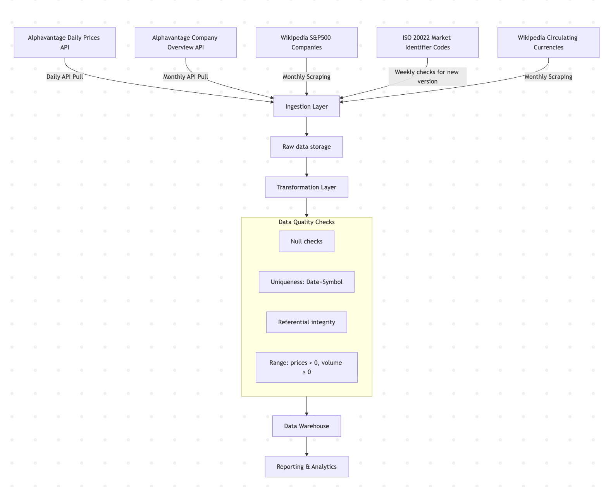

### **Data Architecture & Data Flow**

The project integrates four data sources:

1. **Alphavantage Daily Prices** (API, refreshed daily) – [TIME_SERIES_DAILY example](https://www.alphavantage.co/query?function=TIME_SERIES_DAILY&symbol=IBM&apikey=demo)
2. **Alphavantage Company Overview** (API, refreshed monthly) – [OVERVIEW example](https://www.alphavantage.co/query?function=OVERVIEW&symbol=IBM&apikey=demo)
3. **Wikipedia — List of S&P 500 Companies** (scraped into CSV, refreshed monthly) – [Wikipedia S&P 500 component stocks](https://en.wikipedia.org/wiki/List_of_S%26P_500_companies#S&P_500_component_stocks)
4. **ISO 20022 Market Identifier Codes (MIC)** (CSV file, refreshed weekly) – [ISO 20022 MIC](https://www.iso20022.org/market-identifier-codes)
5. **Wikipedia — List of circulating currencies** (scraped into CSV, refreshed monthly) - https://en.wikipedia.org/wiki/List_of_circulating_currencies

---

### **Ingestion Layer**

- **Alphavantage data** (prices and overviews) is collected with scheduled API pulls.
- The **Wikipedia S&P 500 list** is scraped monthly and saved as CSV.
- **ISO 20022 MIC** is downloaded as CSV and checked weekly for updates.
- All ingestion tasks are orchestrated with **Apache Airflow**.
- Refresh frequencies:
    - Daily → stock prices
    - Monthly → company overviews & S&P 500 list
    - Weekly → MIC data

---

### **Storage Layer**

- All ingested files (API pulls, CSVs) are stored in a **S3 object storage** in their original form for traceability.
- Data is read from raw storage directly into transformation processes.

---

### **Processing & Transformation**

- Data is transformed into a **star schema** using for example **Spark**.
- Transformations include:
    - Parsing API/CSV data into structured tables
    - Key generation (surrogate keys for fact and dimension tables)
    - Type casting and schema alignment across sources
    - Applying data quality checks
- The **Wikipedia CSV** enriches DimCompany with ticker symbols and company details.
- **MIC data** is integrated into DimExchange to standardize exchange identifiers and allow consistent joins with company listings.

---

### **Data Quality Checks**

- **Null checks** on numeric fields (Open, High, Low, Close, Volume)
- **Uniqueness** of (Date, Symbol) in fact table
- **Referential integrity** between fact and dimension tables (no “orphan” fact records)
- **Range checks** (prices > 0, volume ≥ 0)

---

### **Warehouse Layer**

- The dimensional model is stored in a **cloud data warehouse.**
- **Fact Table**: one row per company per trading day
- **Dimensions**:
    - DimDate (calendar breakdown: year, month, day, quarter, etc.)
    - DimCompany (SCD Type 2, with attributes from Alphavantage and Wikipedia)
    - DimExchange (with MIC integration, SCD Type 2)
    - Sector/Industry attributes embedded in DimCompany

---

### **Reporting & Analytics**

- BI tools (Power BI, Tableau, Metabase, etc.) connect to the warehouse.
- Enable dashboards and reports for:
    - Daily stock movements
    - Sector or industry comparisons
    - Exchange-level analysis using standardized MIC codes
- MIC integration ensures globally consistent exchange reporting.

```jsx
flowchart TD
    A[Alphavantage Daily Prices API] --> |Daily API Pull| B[Ingestion Layer]
    A2[Alphavantage Company Overview API] --> |Monthly API Pull| B
    A3[Wikipedia S&P500 Companies] --> |Monthly Scraping| B
    A4[ISO 20022 Market Identifier Codes] --> |Weekly checks for new version| B
    A5[Wikipedia Circulating Currencies] --> |Monthly Scraping| B

    B --> C[Raw data storage]
    C --> D[Transformation Layer]

    E --> F[Reporting & Analytics]

    subgraph DataQuality[Data Quality Checks]
        Q1[Null checks]
        Q2[Uniqueness: Date+Symbol]
        Q3[Referential integrity]
        Q4[Range: prices > 0, volume ≥ 0]
    end

    D --> DataQuality --> E[Data Warehouse]
```
